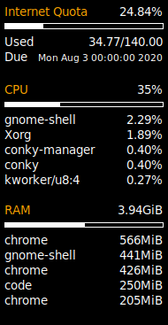

# Telecomegypt Conky

<div align="center"></div>

The Telecomegypt Conky uses the [ispapi](https://github.com/grimpy/ispapi) to get data from http://my.te.eg to show remaining quota on your desktop.

## Dependencies

The only dependencies are `ispapi` and `jq`.

You can install them via

```bash
$ git clone git@github.com:mohamed-zezo/ispapi.git
$ cd ispapi
$ sudo python3 setup.py install --record files.txt
```

```bash
$ sudo apt install jq
```  

to uninstall `ispapi`  
```bash
$ cd ispapi
$ xargs rm -rf < files.txt
```

## Install

```bash
$ mkdir -p ~/.conky
$ git clone git@github.com:mohamed-zezo/telecomegyptConky.git ~/.conky/telecomegyptConky
```

## Configuration

The configuration is made via the `config.json`.

```json
{
	"cache_dir": "/tmp/conky",
	"phone_number": "",
	"password": ""
}
```

##### cache_dir

This is where the telecomegyptForecast stores the temporary data.

##### phone_number

the phone number that used to register you account in http://my.te.eg.

##### password

the hashed password that can be found in the body of login post request after successful login.

## How to run

Once everything is configured you can run it easily:

```bash
$ cd ~/.conky/telecomegyptConky
$ conky -c Telecomegypt
```

## Special thanks to

- [@grimpy](https://github.com/grimpy) for his [ispapi](https://github.com/grimpy/ispapi) package